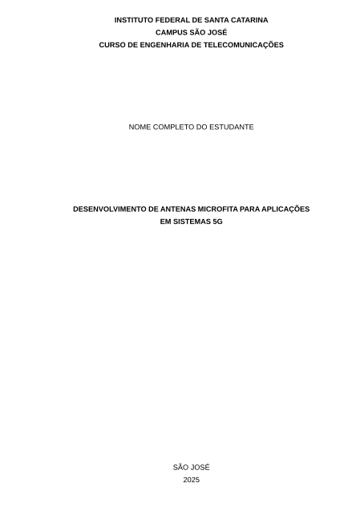
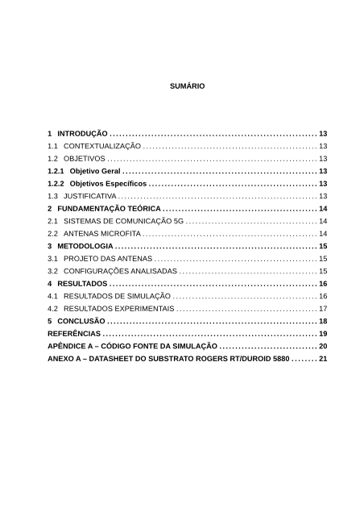
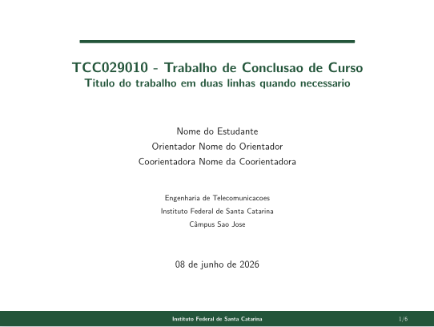
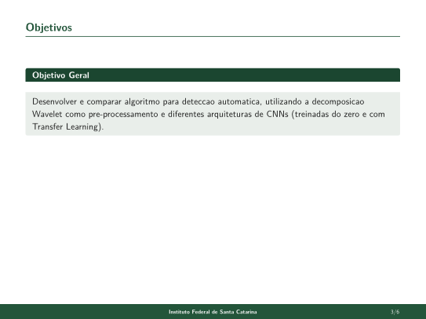

# IFSC TCC Typst

Modelos em [Typst](https://typst.app) para trabalhos acadêmicos do **IFSC** (TCC, monografia) e para a **apresentação de defesa**, formatados conforme o *Manual de Normalização de Trabalhos Acadêmicos* do SiBI/IFSC (rev. 08/abr/2025) e a ABNT (NBR 14724, 6024, 6027 e 6023).


O repositório traz dois modelos independentes:

| Modelo | Para que serve | Arquivos |
| --- | --- | --- |
| 📘 **Monografia** | TCC, monografia (documento ABNT) | `ifsc-template.typ`, `main.typ`, `referencias.bib` |
| 🎞️ **Apresentação** | Slides de defesa (tema institucional, estilo *beamer* IFSC) | `ifsc-saojose.typ`, `exemplo.typ` |

---

## 📸 Pré-visualização

<table>
  <tr>
    <td align="center" width="50%">
      <br>
      <sub><b>Monografia</b> · capa</sub>
    </td>
    <td align="center" width="50%">
      <br>
      <sub><b>Monografia</b> · sumário</sub>
    </td>
  </tr>
  <tr>
    <td align="center" width="50%">
      <br>
      <sub><b>Apresentação</b> · slide de título</sub>
    </td>
    <td align="center" width="50%">
      <br>
      <sub><b>Apresentação</b> · slide de conteúdo</sub>
    </td>
  </tr>
</table>

---

## 🔗 Links

- Projeto online (monografia): https://typst.app/project/rky5kIhcFlEUHSEkd1hHzY
- Projeto online (apresentação): https://typst.app/project/rHQlwhIcnocqCnhrTMbO5O
- Manual de Normalização IFSC (PDF): https://www.ifsc.edu.br/documents/d/documentos-uteis/manual-de-normalizacao_rev_08abr25-pdf

---

## ✨ Recursos

### Monografia
- Elementos pré-textuais prontos: capa, folha de rosto, ficha catalográfica, folha de aprovação, dedicatória, agradecimentos, epígrafe, resumo, abstract.
- **Sumário automático** e **listas de ilustrações, tabelas e quadros automáticas**.
- Numeração progressiva de seções (até a quinária) com hierarquia tipográfica conforme o manual.
- **Paginação ABNT**: contagem a partir da folha de rosto, número exibido só a partir da introdução, no canto superior direito.
- Funções prontas para `figura`, `tabela` e `quadro` (título em cima, fonte embaixo, numeração independente por tipo) e referências cruzadas funcionando.
- **Equações numeradas** "(1)" alinhadas à direita.
- Apêndices e anexos parametrizados.
- **Referências em ABNT** via BibTeX (estilo `associacao-brasileira-de-normas-tecnicas`).

### Apresentação
- Tema institucional IFSC (verde, barra de rodapé com a instituição e numeração `n/total`), proporção 4:3.
- Funções: `slide-titulo`, `slide`, `bloco` (estilo "Objetivo Geral"), `tabela-resultados` (estilo *booktabs*) e `fonte` (legenda de figura).
- Marcadores quadrados, listas numeradas em caixa verde e títulos com régua, no padrão dos TCCs do campus.

---

## 📁 Estrutura sugerida

```
IFSC-TCC-TYPST/
├── tcc/
│   ├── ifsc-template.typ     # tema e regras da monografia (não precisa editar)
│   ├── main.typ              # seu conteúdo (edite aqui)
│   └── referencias.bib       # bibliografia (BibTeX / ABNT)
├── apresentacao/
│   ├── ifsc-saojose.typ      # tema dos slides (não precisa editar)
│   └── exemplo.typ           # modelo de                   # capturas 
```


---

## 🚀 Como usar

### Opção 1: online (recomendado para começar)
1. Abra um dos projetos pelos links acima no [typst.app](https://typst.app).
2. Faça uma cópia do projeto na sua conta.
3. Edite o `main.typ` (monografia) ou o `exemplo.typ` (slides). O PDF é gerado em tempo real.

### Opção 2: local
Instale o Typst (https://github.com/typst/typst) e compile:

```bash
# Monografia
typst compile tcc/main.typ

# Apresentação
typst compile apresentacao/exemplo.typ

# Modo "watch" (recompila ao salvar)
typst watch tcc/main.typ
```

Fontes: a monografia usa **Arial** (Quadro 1 do manual), com alternativas (*Liberation Sans*, *TeX Gyre Heros*, *DejaVu Sans*) quando o Arial não estiver instalado. A apresentação usa *New Computer Modern Sans* com *DejaVu Sans* de reserva. No typst.app essas fontes já estão disponíveis.

---

## ✍️ Personalização

### Monografia: parâmetros do `main.typ`
Tudo é configurado no `#show: ifsc-template.with(...)`:

| Parâmetro | Descrição |
| --- | --- |
| `titulo`, `subtitulo` | título e subtítulo do trabalho |
| `autor`, `orientador`, `coorientador` | autoria |
| `campus`, `curso`, `tipo-trabalho`, `grau` | identificação institucional |
| `cidade`, `ano`, `data-defesa` | local e datas |
| `banca` | lista de examinadores: `(nome: "...", instituicao: "...")` |
| `dedicatoria`, `agradecimentos`, `epigrafe` | elementos opcionais |
| `resumo`, `palavras-chave`, `abstract`, `keywords` | resumos e palavras-chave |
| `lista-figuras`, `lista-tabelas`, `lista-quadros` | ativam as listas automáticas |
| `bibliografia` | caminho do arquivo `.bib` |
| `glossario`, `apendices`, `anexos` | elementos pós-textuais opcionais |
| `fonte-principal` | fonte do texto (padrão `"Arial"`) |

Funções para o corpo do texto:

```typst
// Figura (título em cima, fonte embaixo)
#figura([Modelo da antena], fonte: [elaborada pelo próprio autor.],
  image("antena.png", width: 60%)
) <fig-antena>

// Tabela (formato aberto, normas IBGE)
#tabela([Resultados das simulações], table( ... )) <tab-resultados>

// Quadro (formato fechado, com bordas)
#quadro([Especificações de projeto], table( ... )) <quadro-specs>

// Apêndice e anexo (parte pós-textual)
#apendice("A", "Código fonte da simulação")[ ... ]
#anexo("A", "Datasheet do substrato")[ ... ]
```

### Apresentação: tema e funções
As cores ficam no topo do `ifsc-saojose.typ` (`ifsc-verde`, etc.). Para incluir a logo oficial:

```typst
#show: apresentacao.with(logo: image("logo-ifsc.png", height: 1.1cm))

#slide-titulo(titulo: "...", autores: ("...",), data: "...")
#slide(titulo: "Motivação")[ - ponto 1 ... ]
#slide(titulo: "Objetivos")[ #bloco(titulo: "Objetivo Geral")[ ... ] ]
```

A logo oficial do IFSC não acompanha o repositório (marca registrada): basta colocar o arquivo `logo-ifsc.png` na pasta e passar no parâmetro `logo`.

---

## 📐 Conformidade com o manual

O modelo da monografia segue, entre outros pontos: A4 com margens 3/3/2/2 cm; fonte 12 (Arial ou Times New Roman); espaçamento 1,5 no texto e simples nas exceções (referências, fontes, natureza do trabalho, ficha); títulos sem indicativo centralizados em maiúsculo e negrito; títulos de ilustração com o traço "–" (en-dash, conforme o manual); e referências em ordem alfabética com espaçamento simples.

> Observação: o modelo cobre a estrutura e a formatação. A revisão final de conteúdo, citações e dados da ficha catalográfica (preenchida pela Biblioteca) continua sendo responsabilidade do autor.

---

## 🗒️ Versões

- **0.2** (08/jun/2026): listas de ilustrações/tabelas/quadros automáticas; paginação ABNT corrigida (contagem a partir da folha de rosto); títulos sem indicativo centralizados; funções `figura`/`tabela`/`quadro` com fonte e referência cruzada; equações numeradas; apêndices e anexos parametrizados; hierarquia de seções por nível; modelo de apresentação adicionado.
- **0.1** (08/abr/2025): primeira versão do modelo de monografia.

---

## 🤝 Contribuições

Sugestões, correções e *pull requests* são bem-vindos. Abra uma *issue* descrevendo o ponto do manual ou o ajuste desejado.

---

## 👤 Autor

**Ramon Mayor Martins** — IFSC, Campus São José
GitHub: [@rmayormartins](https://github.com/rmayormartins)

O tema da apresentação foi inspirado no padrão *beamer* institucional usado nos TCCs do campus.

---

## 📄 Licença

Distribuído sob a licença MIT. Veja o arquivo `LICENSE` para mais detalhes. Sinta-se livre para usar e adaptar nos seus trabalhos.
